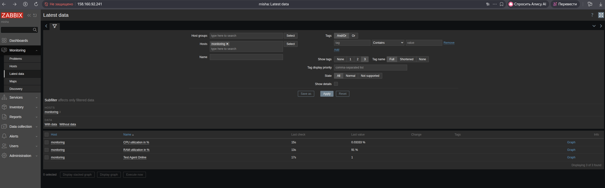
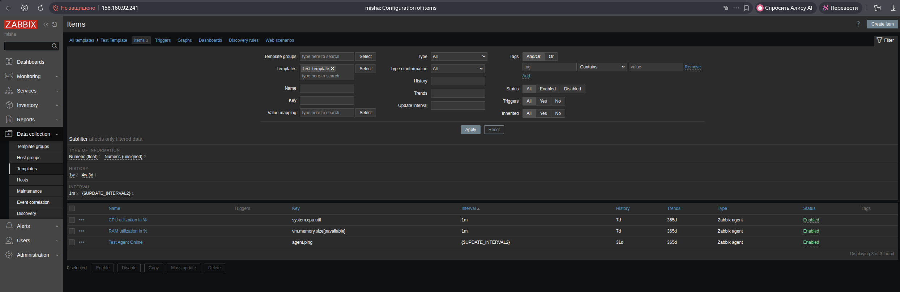
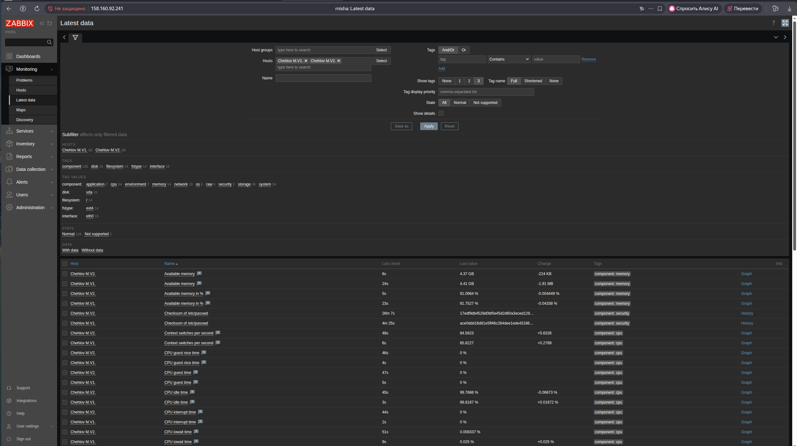
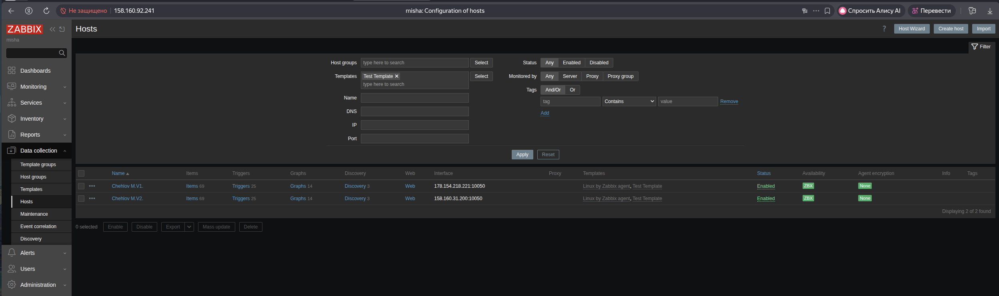
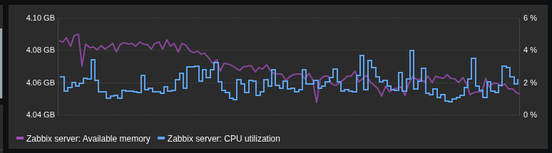

# Домашнее задание к занятию «Система мониторинга Zabbix часть 2»
**Выполнил:** Чехлов Михаил

## Задание 1: создание шаблона с элементами данных, отслеживающими загрузку CPU и RAM хоста..

*Latest data: cpu, ram.*

*Templates — «Test Template» - items.*

## Задание 2: добавление два хоста в zabbix.

*Все отображённые метрики имеют статус normal.*

## Задание 3: Привязка шаблона к двум хостам.

*Status - Enabled.*

## Задание 4: Создание дашборда.

                 
*Zabbix server - available memory, cpu utilization.*

